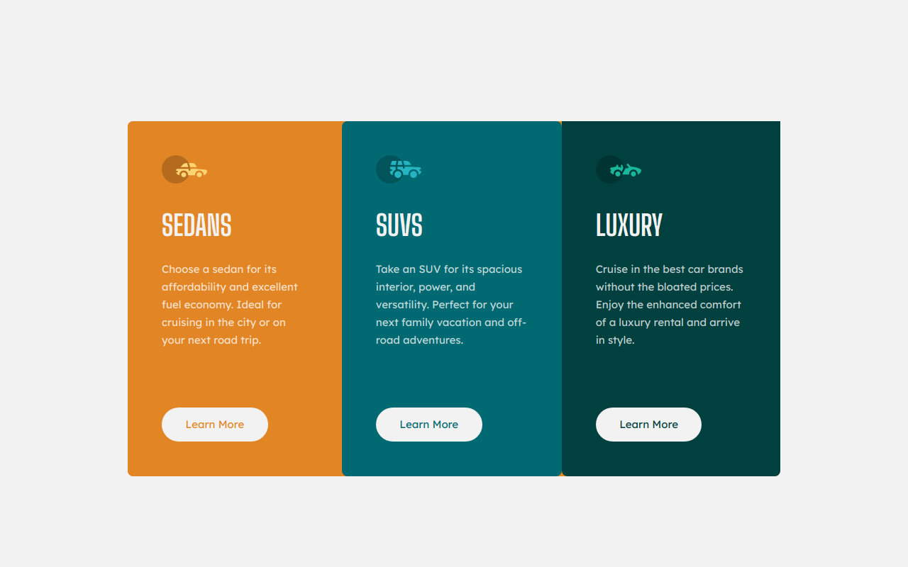

# Frontend Mentor - 3-column preview card component solution

This is a solution to the [3-column preview card component challenge on Frontend Mentor](https://www.frontendmentor.io/challenges/3column-preview-card-component-pH92eAR2-). Frontend Mentor challenges help you improve your coding skills by building realistic projects. 

## Table of contents

- [Overview](#overview)
  - [The challenge](#the-challenge)
  - [Screenshot](#screenshot)
  - [Links](#links)
- [My process](#my-process)
  - [Built with](#built-with)
  - [What I learned](#what-i-learned)
  - [Continued development](#continued-development)
  - [Useful resources](#useful-resources)
- [Author](#author)

## Overview

### The challenge

Users should be able to:

- View the optimal layout depending on their device's screen size
- See hover states for interactive elements

### Screenshot

### Links

- Solution URL: [URL](https://www.frontendmentor.io/solutions/3column-preview-card-component-using-react-VqQzC4zuv_)
- Live Site URL: [URL](https://3-column-preview-card-component-eta-three.vercel.app/)

## My process

### Built with

- Semantic HTML5 markup
- SCSS s 
- Flexbox
- Mobile-first workflow
- [React](https://reactjs.org/) - JS library

### What I learned

This is practice for using React and setting up projects.

### Continued development

React, React and React.

### Useful resources

- [Lists and Keys](https://reactjs.org/docs/lists-and-keys.html) - Great example of rendering multiple components with the map() function.

## Author

- Frontend Mentor - [@miguelzaga](https://www.frontendmentor.io/profile/miguelzaga)

